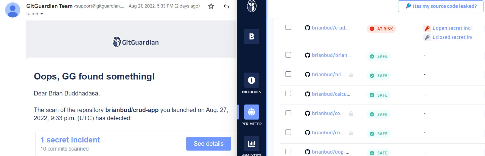

# crud-app

This is my first time learning how to build a CRUD app, and in this readme, I want to document what I've learnt.

## How it's Made:

**Tech Used** JAVASCRIPT, NODE, EXPRESS, MONGODB

### Hoping on the EXPRESS train for the first time

I learnt that installing express is as easy as `npm install express --save`,
I learnt that with npm 5, it's as easy as just `npm install express` or `npm i express`

After creating a server.js file, we could use express in server.js by requiring is

```
const express = require('express');
const app = express();
```

### the R in CRUD is for READ

I learnt that the R in CRUD is for READ operation, and that is when we want to **GET** something.

I learnt how to use the `get` method using

```
app.get('/', (request, response) => {
  res.sendFile(__dirname + '/index.html')
})
```

this is my first time understanding the requested _endpoint_ which is shown as `'/'`
as well as why developers use `__dirname` which is the current directory you are in.
I spent a lot of time trying to debug why things was not working and for future reference, I am writing this as a note to myself to remember to add **Two** underscores in `__dirname`

Until this point, I learnt 1 out of the 4 parts of building a CRUD app. Now I know how Express handles a **GET** Request(**READ** operation).

### Create Post

The C in CRUD is for Create operation and a `<form>` element can be used to send a `POST` request.

In the form element, there is a `method` attribute with the value of `POST` to tell the browser what kind of request to send.

The `action` attribute tells the browser _where_ to send the POST request.

### Express cannot read data

I learnt that Express doesn't handle reading data from the form input and this is where a package like **body-parser** helps.

body-parse helps with tidying up the `request` object before we use them with the `use` method.

## Learning opportunity with Mongodb

On my 1st day learning how to use a database called MongoDB, I had to use a "ConnectionString" to connect the database to my app, the connectionString involves a username and password.



When I pushed my changes to Github, I got an email from GitGuardian regarding a security threat that they scanned and found out that my connectionString username and password was public. This mistake made me learn 2 things:

1. How to revert a pushed commit in git using `git reset Head~1` to unstage your latest commit and `git push -f origin main` to force change this.

2. I learnt about environment variables. You can use .gitignore which tells Git what files to ignore when committing your project to Github, it is common to add your node_module. In addition to node_module, apparently you can also create a .env file with your passwords and add .env to your .gitignore.


### DB, Collections, Documents

I learnt that naming my db is as easy as `const db = client.db('database-name')`

All the express handles requests should be **inside** MongoClient's `then` call.

I also learnt that `collections` are like storage boxes if a Database is a room.

I learnt that `insertOne` method is used to **add** items into a collection and each entry is called a `document`


### Getting quotes

The `.find()` method can be added to the `db.collection('quotes')` that returns a `cursor` object

in addition to find `.toArray` method can convert the data into array.

`const cursor = db.collection('quotes').find().toArray();`

#### Problem with Promise

When trying to return the `cursor` results, it returns `Promise{<pending>}`

`find()` method is asynchronous, that's why the promise is pending since it's still fetching.

To solve this, I add a `.then()` method to deal with this.

Changed from this:

```
      const cursor = db.collection('quotes').find().toArray()
      console.log(cursor);
```

to this:

```db.collection('quotes')
        .find()
        .toArray()
        .then((results) => {
          console.log(results);
        })
        .catch((error) => console.error(error));
```

### EJS

To render the HTML, I used a template engine called **Embedded JavaScript(EJS)**

To tell Express that I am using EJS, I use the `app.set('view engine', 'ejs')`

And to render the HTML, I created a folder called `views` with `index.ejs` in it.

Since the `result` is a JavaScript object, I used a `for loop` using EJS to display the quotes.

### PUT = UPDATE

This is the part learning about the U in CRUD which is the Update Operation using a **PUT** request

I learnt that according to Express conventions, developers use a `public` folder to make it accessible to the public by using a built-in middleware called `express.static`

After adding an eventListener to the update button, I use the Fetch API to trigger a PUT request.

Using the Fetch API on the update button, I need to specify the method, specify the server that we are sending JSON data and to convert that data we send into JSON.

```
const update = document.querySelector('#update-button');

update.addEventListener('click', (_) => {
  fetch('/quotes', {
    method: 'put',
    headers: { 'Content-Type': 'application/json' },
    body: JSON.stringify({
      name: 'Test Name',
      quote: 'This is from main.js',
    }),
  });
});
```
